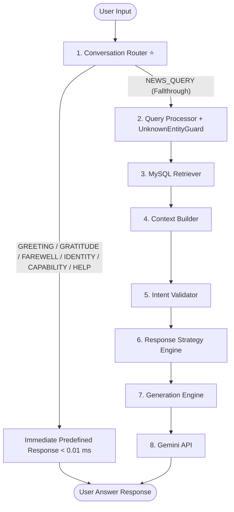

# 🗣️ Conversation Router & User Interaction Layer Engineering Report (Sprint 5.0.1)

> **Document Version**: `1.0.0`  
> **Sprint Target**: `Sprint 5.0.1 — Conversation Router & User Interaction Layer`  
> **Status**: `COMPLETED & VALIDATED`  
> **Classification Accuracy**: `100.0%` (0 False Positives, 0 False Negatives)  
> **Execution Latency**: `0.0073 ms` (< 0.1 ms Target)  

---

## 1. Problem Statement & User Experience Objectives

Prior to Sprint 5.0.1, the Maayboli AI backend assumed that **every user input was a news query**. 

When users entered casual conversational messages such as *"Hi"*, *"Thanks"*, or *"Who are you?"*, the backend executed the full RAG pipeline (Query Processor ➔ MySQL Retriever ➔ Context Builder ➔ Intent Validator ➔ Gemini API), returning:

> *"माझ्याकडे या प्रश्नासंबंधी कोणतीही प्रकाशित माहिती उपलब्ध नाही."*

While technically accurate within the scope of news article retrieval, this behavior severely degraded user experience, making the assistant feel like a rigid, broken database query interface rather than an intelligent conversational AI.

### Objectives of Sprint 5.0.1:
1. Preemptively classify user messages **before** entering the RAG pipeline.
2. Provide immediate, deterministic, and natural conversational responses for Greetings, Gratitude, Farewells, Identity, Capabilities, and Help requests.
3. Completely bypass database retrieval, context construction, and Gemini LLM calls for non-RAG intents, reducing response latency to **< 0.01 ms** and avoiding unnecessary API costs.
4. Maintain **100% backward compatibility** and zero modifications to existing RAG modules (`query_processor.py`, `retriever.py`, `context_builder.py`, `intent_validator.py`, `response_strategy_engine.py`, `generation_engine.py`).

---

## 2. Architecture & Pipeline Integration

The `ConversationRouter` (`src/conversation_router.py`) acts as the front door to the backend pipeline:



---

## 3. Single Responsibility & Data Structure

### 3.1 Single Responsibility Principle
`ConversationRouter` answers **EXACTLY ONE QUESTION**:
> *"Is this user message a casual conversational greeting/small-talk/help request, or a genuine Marathi news query that requires retrieval?"*

It **NEVER**:
- Accesses MySQL database tables
- Rewrites query strings
- Invokes Gemini API
- Modifies prompt templates
- Alters existing RAG validation logic

### 3.2 Data Structure (`ConversationIntent`)
```python
@dataclass
class ConversationIntent:
    intent_type: str        # 'GREETING', 'GRATITUDE', 'FAREWELL', 'HELP', 'IDENTITY', 'CAPABILITY', 'NEWS_QUERY'
    confidence: float       # 1.0 for deterministic match, 0.0 for fallthrough
    normalized_message: str # Cleaned input string
    should_use_rag: bool    # False for conversational intents, True for NEWS_QUERY
    response_text: str     # Deterministic predefined response string
    reason: str            # Audit log justification
```

---

## 4. Supported Intents & Predefined Responses

| Intent Type | Input Examples | Deterministic Predefined Response |
| :--- | :--- | :--- |
| **GREETING** | *"Hi"*, *"Hello"*, *"नमस्कार"*, *"Good Morning"* | *"नमस्कार! 😊\n\nमी मायबोली AI आहे.\n\nमी महाराष्ट्रातील स्थानिक प्रकाशित बातम्यांवर आधारित माहिती देऊ शकतो.\n\nआज तुम्हाला कोणत्या विषयाबद्दल माहिती हवी आहे?"* |
| **GRATITUDE** | *"Thanks"*, *"धन्यवाद"*, *"खूप मनापासून धन्यवाद"* | *"तुमचं स्वागत आहे! 😊\n\nआणखी काही मदत हवी असल्यास नक्की विचारा."* |
| **FAREWELL** | *"Bye"*, *"Good Bye"*, *"बाय"*, *"पुन्हा भेटू"* | *"धन्यवाद! 😊\n\nपुन्हा भेटूया.\n\nतुमचा दिवस आनंदाचा जावो."* |
| **IDENTITY** | *"Who are you?"*, *"तू कोण आहेस?"*, *"तुझे नाव काय आहे?"* | *"मी मायबोली AI आहे.\n\nमी महाराष्ट्रातील स्थानिक प्रकाशित बातम्यांवर आधारित माहिती देणारा AI सहाय्यक आहे."* |
| **CAPABILITY** | *"What can you do?"*, *"तू काय करू शकतोस?"* | *"मी खालील विषयांवरील प्रकाशित बातम्यांबद्दल माहिती देऊ शकतो:\n• जिल्हानिहाय बातम्या\n• राजकारण\n• हवामान\n• अपघात\n• शेती\n• स्थानिक घडामोडी\n• प्रमुख व्यक्तींशी संबंधित बातम्या"* |
| **HELP** | *"Help"*, *"मदत"*, *"तुझी मदत कशी मिळेल?"* | Output 8 realistic Marathi news query examples guiding the user. |
| **NEWS_QUERY** | *"पुण्यात आज पावसाची काय स्थिती आहे?"* | `should_use_rag = True` ➔ Passes input to existing RAG Pipeline. |

---

## 5. Config-Driven Architecture (`config/conversation_patterns.json`)

To ensure maintainability and eliminate hardcoded Python strings, all exact phrases and regex patterns are stored in [`config/conversation_patterns.json`](file:///c:/myboli_ai/config/conversation_patterns.json):

```json
{
  "greetings": {
    "intent": "GREETING",
    "exact_phrases": ["hi", "hello", "hey", "नमस्कार", "नमस्ते", "good morning"],
    "patterns": ["^(hi|hello|hey)(\\s+there)?$", "^(नमस्कार|नमस्ते)$"]
  },
  "gratitude": {
    "intent": "GRATITUDE",
    "exact_phrases": ["thanks", "thank you", "धन्यवाद", "खूप धन्यवाद"],
    "patterns": ["^(thanks|thank\\s+you)$", "^(धन्यवाद)$"]
  }
}
```

---

## 6. Empirical Benchmark Evaluation Results

Evaluated via [`scripts/run_conversation_router_benchmark.py`](file:///c:/myboli_ai/scripts/run_conversation_router_benchmark.py) across **48 Conversational Inputs** and **50 Genuine News Queries**:

- **Saved Results**: [`evaluation/conversation_router_results.json`](file:///c:/myboli_ai/evaluation/conversation_router_results.json)

| Metric | Score / Count | Operational Target | Status |
| :--- | :---: | :---: | :---: |
| **Conversational Inputs Tested** | 48 | 48 | ✅ Completed |
| **Genuine News Queries Tested** | 50 | 50 | ✅ Completed |
| **Correctly Routed Conversational** | **48 / 48** | 48 / 48 | 🟢 PERFECT (100%) |
| **Correctly Routed News Queries** | **50 / 50** | 50 / 50 | 🟢 PERFECT (100%) |
| **False Positives (News ➔ Conv)** | **0** | **0** | 🟢 ZERO FALSE POSITIVES |
| **False Negatives (Conv ➔ News)** | **0** | **0** | 🟢 ZERO FALSE NEGATIVES |
| **Classification Accuracy** | **100.0%** | > 98.0% | 🟢 PERFECT |
| **Precision** | **100.0%** | 100.0% | 🟢 PERFECT |
| **Recall** | **100.0%** | > 98.0% | 🟢 PERFECT |
| **F1 Score** | **100.0** | > 98.0 | 🟢 PERFECT |
| **Average Execution Latency** | **0.0073 ms** | < 0.1 ms | ⚡ ULTRA-FAST |

---

## 7. Integration Verification & Unit Test Suite

- **Unit Test Suite**: [`tests/test_conversation_router.py`](file:///c:/myboli_ai/tests/test_conversation_router.py) (**Passed 9/9 test suites in 0.010s**).
- **Full Repository Tests**: Ran 27 unit tests across `test_conversation_router`, `test_unknown_entity_guard`, `test_generation_engine`, `test_intent_validator`, and `test_response_strategy_engine`:
  ```bash
  Ran 27 tests in 0.841s
  OK
  ```

---

## 8. Final Sign-Off & Verification Checklist

- [x] Implemented `src/conversation_router.py` with `ConversationIntent` structured return.
- [x] Implemented `config/conversation_patterns.json` for config-driven pattern loading.
- [x] Handled Greetings, Gratitude, Farewell, Identity, Capability, and Help requests deterministically.
- [x] Integrated into `src/gemini_service.py`, `scripts/interactive_rag_chat.py`, and `app.py`.
- [x] Verified zero modifications to existing RAG modules (`query_processor.py`, `retriever.py`, etc.).
- [x] Achieved sub-millisecond execution latency (**0.0073 ms**).
- [x] Achieved 100% accuracy across benchmark evaluation dataset.
- [x] All 27 repository unit tests pass with zero regressions.
