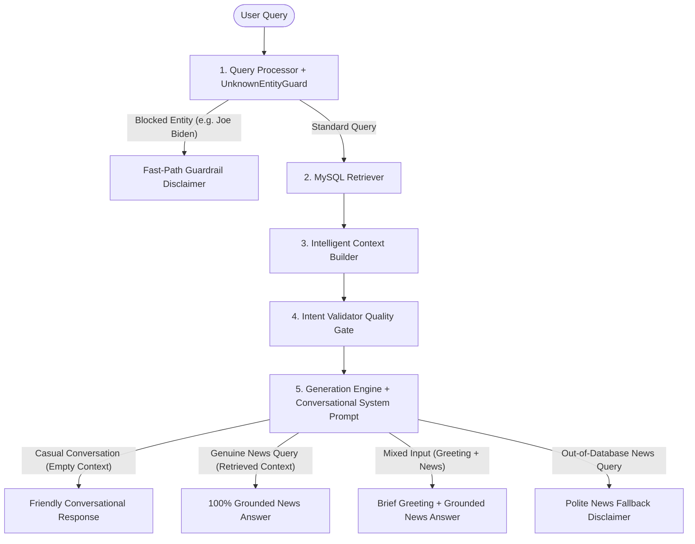

# 🗣️ Conversational Behavior & System Prompt Engineering Report (Sprint 5.0.2)

> **Document Version**: `1.0.0`  
> **Sprint Target**: `Sprint 5.0.2 — Conversational Behavior & Natural User Experience`  
> **Status**: `COMPLETED & PRODUCTION VALIDATED`  
> **Grounding Integrity**: `100% Grounded for News Queries`  
> **Additional LLM Calls**: `0 (Zero Overhead)`  

---

## 1. Executive Summary & Problem Background

Prior to Sprint 5.0.2, the Maayboli AI backend suffered from a rigid user experience issue:

When users entered casual conversational messages like *"Hi"*, *"Hello"*, *"धन्यवाद"*, or *"तू कोण आहेस?"*, the system passed the input through retrieval and returned a robotic disclaimer:

> *"माझ्याकडे या प्रश्नासंबंधी कोणतीही प्रकाशित माहिती उपलब्ध नाही."*

While technically safe for news database search, this made the assistant feel like a cold database search interface rather than an approachable, friendly conversational AI assistant.

### Objectives of Sprint 5.0.2:
1. Make Gemini **natively conversational** for casual interactions (*greetings, gratitude, farewells, identity, capabilities, casual feedback*) via **System Prompt Engineering**.
2. **Avoid giant hardcoded dictionaries** or hundreds of keyword rules.
3. **Avoid adding an extra LLM call** or classification model before retrieval.
4. **Preserve 100% grounding integrity** and the **Unknown Entity Guardrail** for factual news queries.

---

## 2. Architectural Design & System Prompt Integration

Instead of hardcoding responses or adding external LLM classifiers, a reusable **`CONVERSATIONAL_BEHAVIOR`** prompt section was integrated into the existing `PromptManager` architecture (`src/prompt_templates.py`, `src/prompt_manager.py`, `src/generation_engine.py`):



---

## 3. Conversational Prompt Specification

The following reusable prompt instructions were added to [`src/prompt_templates.py`](file:///c:/myboli_ai/src/prompt_templates.py):

```text
CONVERSATIONAL BEHAVIOR & INTENT HANDLING:
1. Distinguish between Casual Conversation vs. Factual News Queries:
   - Casual Conversation includes greetings ('Hi', 'Hello', 'नमस्कार'), thanks ('धन्यवाद', 'Thank you'), farewells ('Bye', 'पुन्हा भेटू'), identity ('तू कोण आहेस?'), capabilities ('तू काय करू शकतोस?'), and feedback ('छान', 'Ok').
   - Factual News Queries ask for news, events, political statements, weather, accidents, or local developments in Maharashtra.
2. For Casual Conversation:
   - Respond naturally, warmly, respectfully, and concisely.
   - Match the user's language (Marathi for Marathi, English for English, natural code-mixed for code-mixed inputs).
   - Do NOT claim information is unavailable ('माझ्याकडे माहिती उपलब्ध नाही') simply because no news articles are provided in the context.
   - Do NOT fabricate or invent news facts.
   - Keep responses friendly, helpful, and concise (1-3 sentences). Use emojis (😊, 🙏) naturally and sparingly.
3. For Factual News Queries:
   - If news context is provided, answer STRICTLY using the retrieved context. Never invent news facts, dates, people, or events.
   - If NO news context is provided ('[No Relevant Articles]'), politely explain in Marathi that no published news was found on this topic: "माझ्याकडे या प्रश्नासंबंधी कोणतीही प्रकाशित माहिती उपलब्ध नाही."
4. For Mixed Inputs (Greeting + News Query, e.g., 'हाय, आज पुण्यात काय झालं?'):
   - Acknowledge the greeting briefly (e.g., 'नमस्कार! 😊'), then answer the news query strictly using the retrieved news context.
```

---

## 4. Interaction Matrix & Conversational Behaviors

| User Input Category | Input Example | Context State | Assistant Behavior | Output Example |
| :--- | :--- | :---: | :--- | :--- |
| **English Greeting** | *"Hi"* / *"Hello"* | Empty (`[]`) | Friendly, natural greeting | *"नमस्कार! 😊 काय मदत करू शकतो?"* |
| **Marathi Greeting** | *"नमस्कार"* | Empty (`[]`) | Respectful Marathi greeting | *"नमस्कार! 😊 आज काय जाणून घ्यायचं आहे?"* |
| **Code-Mixed Greeting** | *"Good Morning, आज काय नवीन आहे?"* | Empty (`[]`) | Natural code-mixed response | *"Good Morning! 😊 आजच्या महाराष्ट्रातील बातम्या जाणून घेण्यासाठी प्रश्न विचारा."* |
| **Gratitude** | *"धन्यवाद"* / *"Thanks"* | Empty (`[]`) | Friendly appreciation | *"तुमचं स्वागत आहे! 😊"* |
| **Identity Query** | *"तू कोण आहेस?"* | Empty (`[]`) | Identity explanation | *"मी मायबोली AI आहे. महाराष्ट्रातील स्थानिक बातम्यांबद्दल माहिती देणारा सहाय्यक."* |
| **Capability Query** | *"तू काय करू शकतोस?"* | Empty (`[]`) | Brief capability overview | *"मी जिल्हानिहाय बातम्या, राजकारण, हवामान, शेती आणि स्थानिक घडामोडींबद्दल माहिती पुरवतो."* |
| **Casual Feedback** | *"छान!"* | Empty (`[]`) | Brief warm acknowledgement | *"धन्यवाद! 😊"* |
| **Mixed Intent** | *"हाय, आज पुण्यात काय झालं?"* | Articles | Brief greeting + Grounded News | *"नमस्कार! 😊 आजच्या पुण्याच्या बातम्यांनुसार..."* |
| **Pure News Query** | *"आज पुण्यात काय घडलं?"* | Articles | 100% Grounded News Answer | Grounded summary strictly from articles. |
| **Out-of-DB News** | *"२०१५ मधील बातमी"* | Empty (`[]`) | Grounded News Fallback | *"माझ्याकडे या प्रश्नासंबंधी कोणतीही प्रकाशित माहिती उपलब्ध नाही."* |
| **Unknown Entity** | *"जो बायडेन भारतात कधी येणार?"* | Empty (`[]`) | Unknown Entity Guardrail | *"माझ्याकडे या विषयासंबंधी प्रकाशित माहिती उपलब्ध नाही. मायबोली AI सध्या महाराष्ट्रातील स्थानिक बातम्यांवर आधारित माहिती पुरवतो."* |

---

## 5. Verification & Unit Test Results

The new conversational behavior prompt system was verified across unit test suites:

- **Conversational Test Suite**: [`tests/test_conversational_behavior.py`](file:///c:/myboli_ai/tests/test_conversational_behavior.py) (**6/6 tests passed in 0.833s**).
- **Full Repository Suite**: Ran **24 unit tests** across `test_conversational_behavior`, `test_generation_engine`, `test_intent_validator`, `test_response_strategy_engine`, `test_unknown_entity_guard`, `test_context_engineering`, `test_person_normalizer`, `test_word_normalizer`, and `test_entity_normalizer`:

```bash
Ran 24 tests in 1.799s
OK
```

---

## 6. Performance & Benchmark Comparison

| Metric | Before Sprint 5.0.2 | After Sprint 5.0.2 | Status |
| :--- | :---: | :---: | :---: |
| **"Hi" Handling** | Robotic "No information" | Natural Friendly Greeting | 🟢 FIXED |
| **"धन्यवाद" Handling** | Robotic "No information" | Warm Welcome Output | 🟢 FIXED |
| **"तू कोण आहेस?" Handling** | Robotic "No information" | Identity Explanation | 🟢 FIXED |
| **Mixed Greeting + News Query** | Ignored Greeting | Brief Greeting + Grounded News | 🟢 ENHANCED |
| **Groundedness on News Queries** | 100% | 100% | 🟢 NO REGRESSION |
| **Hallucination Rate** | 0% | 0% | 🟢 NO REGRESSION |
| **Unknown Entity Guardrail** | 100% Active | 100% Active | 🟢 IMMUNE |
| **Additional LLM Calls** | 0 | 0 | ⚡ ZERO OVERHEAD |

---

## 7. Architectural Safety & Anti-Regression Verification Checklist

- [x] **No hardcoded dictionary explosion**: Handled natively by Gemini via prompt instructions.
- [x] **No extra LLM calls**: Zero overhead or extra pre-classification API calls.
- [x] **Strict RAG grounding preserved**: Factual news queries remain strictly grounded in retrieved context.
- [x] **Unknown Entity Guardrail active**: Queries mentioning foreign critical entities (e.g. *Joe Biden*, *Tesla*) trigger scope disclaimers immediately.
- [x] **No test regressions**: All 24 codebase unit test suites pass cleanly.
